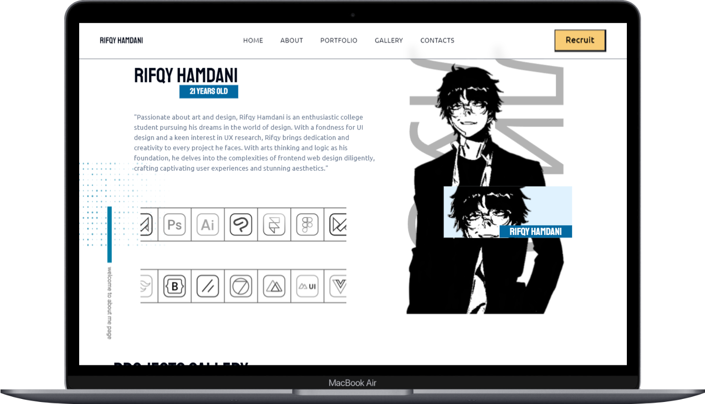

#  Greetings
Hi, I'm Rifqy Hamdani, a passionate UI/UX Designer and Frontend Developer from Indonesia. I love crafting seamless user experiences and building responsive, intuitive interfaces. I'm particularly interested in combining design aesthetics with frontend development to create beautiful and functional web applications. Let’s build something amazing together!
##

  

## My Life Support!
 
## Design

 

 
 

## Frontend

 

 

 
 

## Backend

## Database

 
 

## Tools

 

## Deployment

##

  

##

##  Personal Website

  
  

  visit my personal website
  - https://rifqyluo-personalweb.vercel.app/
  

## Contact
- instagram - [@rifrifqyqy](https://www.instagram.com/rifrifqyqy/)
- whatsapp - 081288233054
- gmail - rifqyh22@gmail.com

---

<!-- Proudly created with GPRM ( https://gprm.itsvg.in ) -->
